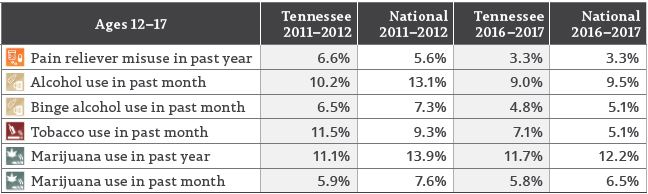

```{r, include=F}
library(gtsummary)
library(labelled)
library(haven)
library(readxl)
library(sysfonts)
library(kableExtra)
library(gridExtra)
library(ggpubr)
library(ggrepel)
library(tidyverse)
library(tidymodels)

knitr::opts_chunk$set(echo = F, warning = F, message = F)
```
```{r, include=F}
data<-read_dta("M:/334 - TN Together/000 - TN Together 2020-21 Administration/Analysis/output/analyticaldataset.dta")
```

# Cigarettes, Nicotine, and Vaping

Nearly one in five deaths in the United States is caused by cigarette smoking, making it the leading cause of preventable death nationally (Centers for Disease Control and Prevention [CDC], 2014). Although the prevalence of smoking has
decreased over time, the recent emergence of Electronic Nicotine Delivery Systems (ENDS; also often referred to as e-cigarettes) have contributed greatly to rising rates of nicotine consumption. Whereas the long-term consequences of ENDS use are not yet known, research has shown that youth who use ENDS are highly likely to also smoke traditional cigarettes. The health consequences associated with smoking are well established and include lung cancer, cardiovascular and metabolic diseases, and respiratory diseases (Lipari, 2013). 

Findings from the National Survey on Drug Use and Health (NSDUH) reveal that Tennessee youth report higher past-month use rates of tobacco than the national average (see Figure 1). And, while Tennessee youth reported tobacco use at lower rates in 2016–2017 than in 2011–2012, they still outpaced the national average. 



According to the Tennessee Together Student Survey (TN Together, 2018-2019), a statewide Tennessee survey administered to 8th-, 10th-, and 12th-grade public school youth, nearly one in three students (29.8%) reported vaping or using e-cigarettes in their lifetime—evidence of the growing popularity of ENDS among youth. Nearly 20 percent (19.1%) of students reported using in the past 30 days, more than double the rate of past-month cigarette use. Finally, more than half of current e-cigarette users (52.9%) reported smoking on a regular basis (i.e., six or more days in the past month). 

Understanding youth substance use begins with understanding the risk and protective factors related to such use. These factors include access to substances, perceived risk of substance use, peer use, and social norms regarding use. The TN Together survey revealed that nearly 70 percent of students felt that it was “fairly easy” or “very easy” to obtain tobacco products in their communities, which may contribute to their high use prevalence. Students also reported that social norms regarding e-cigarettes were favorable toward use, with more than 40 percent of youth perceiving that their peers would not disapprove if they smoked e-cigarettes. Further, more than 40 percent (41.7%) of students believed that at least one of their closest friends had vaped or used e-cigarettes in the past 12 months. Importantly, more than one-third of students (34.0%) perceived “no risk” or only “slight risk” associated with e-cigarette use. This low perception of risk and high level of perceived social acceptability may be important contributing factors to the high rates of e-cigarette use in the Tennessee student population (Tennessee Department of Mental Heath and Substance Abuse Services [TDMHSAS], 2019).

## Predictors of Use
While much research has focused on predictors of youth substance use, very little has been done to specifically examine factors related to youth ENDS use. This study seeks to analyze the most recent TN Together Survey data (2020-2021) to identify key predictors of Tennessee youth vaping behaviors. Key predictors examined include: perception of risk, perceived access, and peer approval of ENDS use. In sum, this study seeks to answer the question: Which risk factors predict TN youth past 30-day ENDS use?  

## The Data
The 2020-2021 TN Together Student Survey data includes data from over 17,000 Tennessee 8th-, 10th-, and 12th-grade students from 34 counties across the state of Tennessee. This anonymous student survey includes measures related to substance use as well as potential risk and protective factors. 

# TN Students' ENDS Use
The figure below displays the distribution of students' self-reported past-30-day ENDS use. Note that this ENDS use includes vaping nicotine, marijuana, and/or flavoring only (i.e., any vaping behaviors). 
```{r, fig.height=4}
#create any ENDS use in PM
dataup<-data%>%
  filter(q11b!=77 & !is.na(q11b))%>%
    mutate(anyends=ifelse(q11b!=0, q11b,
                          ifelse(q12b!=0 & q12b!=77 & !is.na(q12b), q12b,
                                 ifelse(q13b!=0 & q13b!=77 & !is.na(q13b), q13b,
                                        q11b))))

ENDSuse<-dataup %>%
  mutate(endsuse=dplyr::recode(anyends, `0`='No Use', `1`='Use on One or More Days', `2`='Use on One or More Days',
                               `3`='Use on One or More Days', `4`='Use on One or More Days', 
                               `5`='Use on One or More Days',
                               `6`='Use on One or More Days'))

ENDSdv<-ENDSuse%>%
    group_by(endsuse)%>%
    summarize(count=n())

mycolors<-c("#052F5F", "#03644b")

plotdv<- ggplot(ENDSdv, aes(x=endsuse, y=count, fill=endsuse)) + 
  geom_bar(stat="identity", position=position_dodge(), fill=mycolors) +
  geom_text(aes(label=count), vjust=-.5) +
  scale_y_continuous(expand=c(0,0), limits=c(0, 15500)) +
  theme(panel.grid.major=element_blank(), panel.grid.minor = element_blank(),
        panel.background=element_blank(), 
        axis.line=element_line(colour = "black"), 
        axis.text.x=element_text(color="black", size=11, vjust=.5),
        axis.text.y=element_text(color="black", size=11),
        axis.title.x=element_blank(),
        legend.position="none",
        plot.title=element_text(hjust=0.5, size=11)) +
    ylab("Student Count")+
  ggtitle("Past-30-Day ENDS Use")
plotdv
```
While most students reported no past-30-day use, approximately 18 percent of students surveys reported ENDS use in the past 30 days. This equates to almost one-in-five TN youth reporting current vaping behaviors.  

## Examining Potential Predictors of ENDS Use

### Demographic Indicators
Some substance using behaviors may vary by demographic indicators such as gender or race, and substance use often increases as students progress through school/adolescence. The figure below displays ENDS use by grade (surveyed grades included grades 8, 10, and 12), self-reported gender (Female, Male, Other), white or Black race, and Hispanic or non-Hispanic ethnicity. 
```{r demogs}
#Grade
grade<-ENDSuse%>%
  filter(!is.na(q2))%>%
  group_by(q2)%>%
  mutate(grade_n=n())%>%
  select(grade=q2, grade_n)%>%
  distinct()%>%
  ungroup()

gradeEND<-ENDSuse%>%
  filter(!is.na(q2))%>%
  group_by(q2, endsuse)%>%
  mutate(used=n())%>%
  select(grade=q2, used)%>%
    filter(endsuse=="Use on One or More Days")%>%
  distinct()%>%
  ungroup()

gradeENDS<-left_join(grade, gradeEND)%>%
    replace_na(list(used=0))%>%
    select(-endsuse)%>%
    mutate(pct_use=round(used/grade_n*100, 1))%>%
    select(grade, pct_use)%>%
    arrange(grade)

gg_grade<-ggplot(gradeENDS, aes(x=as.factor(grade), y=as.numeric(pct_use))) +
  geom_bar(stat="identity", fill="#031c39") +
  geom_label_repel(aes(label=paste0(pct_use,"%")), 
                   label.size = NA, size=3, box.padding = 0.3, direction="x", segment.colour=NA, 
                   nudge_y = 1) +
  scale_x_discrete(labels=paste0(gradeENDS$grade,"th")) +
      scale_y_continuous(expand=c(0,0)) +
  theme(panel.grid.major = element_blank(), panel.grid.minor = element_blank(),
        panel.background = element_blank(), axis.line = element_line(colour = "black"),
        axis.title.x=element_blank(), axis.title.y = element_blank(), axis.text.x=element_blank(), 
        axis.ticks.x=element_blank(), text=element_text(size=9), 
        plot.title=element_text(hjust=0.5)) + 
  ggtitle("ENDS Use by Grade") +
  coord_flip()

#Gender
ENDSuse<-ENDSuse%>%
  mutate(q4=dplyr::recode(q4, `1`='Male', `2`='Female', `3`='Other'))

Gender<-ENDSuse%>%
  filter(!is.na(q4))%>%
  group_by(q4)%>%
  mutate(Gender_n=n())%>%
  select(Gender=q4, Gender_n)%>%
  distinct()%>%
  ungroup()

GenderEND<-ENDSuse%>%
  filter(!is.na(q4))%>%
  group_by(q4, endsuse)%>%
  mutate(used=n())%>%
  select(Gender=q4, used)%>%
    filter(endsuse=="Use on One or More Days")%>%
  distinct()%>%
  ungroup()

GenderENDS<-left_join(Gender, GenderEND)%>%
    replace_na(list(used=0))%>%
    select(-endsuse)%>%
    mutate(pct_use=round(used/Gender_n*100, 1))%>%
    select(Gender, pct_use)%>%
    arrange(Gender)

order<-c("Male", "Female", "Other")
GenderENDS$Gender <- factor(GenderENDS$Gender, levels = order)

gg_Gender<-ggplot(GenderENDS, aes(x=as.factor(Gender), y=as.numeric(pct_use))) +
  geom_bar(stat="identity", fill="#031c39") +
  geom_label_repel(aes(label=paste0(pct_use,"%")), 
                   label.size = NA, size=3, box.padding = 0.3, direction="x", segment.colour=NA, 
                   nudge_y = 1) +
  scale_x_discrete(labels=GenderENDS$Gender) +
      scale_y_continuous(expand=c(0,0)) +
  theme(panel.grid.major = element_blank(), panel.grid.minor = element_blank(),
        panel.background = element_blank(), axis.line = element_line(colour = "black"),
        axis.title.x=element_blank(), axis.title.y = element_blank(), axis.text.x=element_blank(), 
        axis.ticks.x=element_blank(), text=element_text(size=9), 
        plot.title=element_text(hjust=0.5)) + 
  ggtitle("ENDS Use by Gender") +
  coord_flip()

#Black
ENDSuse<-ENDSuse%>%
  mutate(black=dplyr::recode(black, `1`="Black", `0`="Not Black"))

Black<-ENDSuse%>%
  filter(!is.na(black))%>%
  group_by(black)%>%
  mutate(Black_n=n())%>%
  select(Black=black, Black_n)%>%
  distinct()%>%
  ungroup()

BlackEND<-ENDSuse%>%
  filter(!is.na(black))%>%
  group_by(black, endsuse)%>%
  mutate(used=n())%>%
  select(Black=black, used)%>%
    filter(endsuse=="Use on One or More Days")%>%
  distinct()%>%
  ungroup()

BlackENDS<-left_join(Black, BlackEND)%>%
    replace_na(list(used=0))%>%
    select(-endsuse)%>%
    mutate(pct_use=round(used/Black_n*100, 1))%>%
    select(Black, pct_use)%>%
    arrange(Black)%>%
    filter(Black=="Black")

names(BlackENDS)<-c("Race/Ethnicity", "Pct Used")

#White
ENDSuse<-ENDSuse%>%
  mutate(white=dplyr::recode(white, `1`="White", `0`="Not White"))

White<-ENDSuse%>%
  filter(!is.na(white))%>%
  group_by(white)%>%
  mutate(White_n=n())%>%
  select(White=white, White_n)%>%
  distinct()%>%
  ungroup()

WhiteEND<-ENDSuse%>%
  filter(!is.na(white))%>%
  group_by(white, endsuse)%>%
  mutate(used=n())%>%
  select(White=white, used)%>%
    filter(endsuse=="Use on One or More Days")%>%
  distinct()%>%
  ungroup()

WhiteENDS<-left_join(White, WhiteEND)%>%
    replace_na(list(used=0))%>%
    select(-endsuse)%>%
    mutate(pct_use=round(used/White_n*100, 1))%>%
    select(White, pct_use)%>%
    arrange(White)%>%
    filter(White=="White")

names(WhiteENDS)<-c("Race/Ethnicity", "Pct Used")

#Hispanic
ENDSuse<-ENDSuse%>%
  mutate(hispanic=dplyr::recode(hispanic, `1`="Hispanic", `0`="Not Hispanic"))

Hispanic<-ENDSuse%>%
  filter(!is.na(hispanic))%>%
  group_by(hispanic)%>%
  mutate(Hispanic_n=n())%>%
  select(Hispanic=hispanic, Hispanic_n)%>%
  distinct()%>%
  ungroup()

HispanicEND<-ENDSuse%>%
  filter(!is.na(hispanic))%>%
  group_by(hispanic, endsuse)%>%
  mutate(used=n())%>%
  select(Hispanic=hispanic, used)%>%
    filter(endsuse=="Use on One or More Days")%>%
  distinct()%>%
  ungroup()

HispanicENDS<-left_join(Hispanic, HispanicEND)%>%
    replace_na(list(used=0))%>%
    select(-endsuse)%>%
    mutate(pct_use=round(used/Hispanic_n*100, 1))%>%
    select(Hispanic, pct_use)%>%
    arrange(Hispanic)%>%
    filter(Hispanic=="Hispanic")

names(HispanicENDS)<-c("Race/Ethnicity", "Pct Used")

racethENDS<-rbind(BlackENDS, WhiteENDS, HispanicENDS)

gg_race<-ggplot(racethENDS, aes(x=as.factor(`Race/Ethnicity`), y=as.numeric(`Pct Used`))) +
  geom_bar(stat="identity", fill="#031c39") +
  geom_label_repel(aes(label=paste0(`Pct Used`,"%")), 
                   label.size = NA, size=3, box.padding = 0.3, direction="x", segment.colour=NA, 
                   nudge_y = 1) +
  scale_x_discrete(labels=racethENDS$`Race/Ethnicity`) +
      scale_y_continuous(expand=c(0,0)) +
  theme(panel.grid.major = element_blank(), panel.grid.minor = element_blank(),
        panel.background = element_blank(), axis.line = element_line(colour = "black"),
        axis.title.x=element_blank(), axis.title.y = element_blank(), axis.text.x=element_blank(), 
        axis.ticks.x=element_blank(), text=element_text(size=9), 
        plot.title=element_text(hjust=0.5)) + 
  ggtitle("ENDS Use by Race/Ethnicity") +
  coord_flip()
```

```{r, fig.height=3.5}
layout_matrix <- matrix(c(1, 1, 2, 2, 4, 3, 3, 4), nrow = 2, byrow = TRUE)
grid.arrange(gg_grade, gg_Gender, gg_race, layout_matrix = layout_matrix)
```

Examining the demographic plots above, it appears that, as anticipated, ENDS use was higher for high-school students compared to middle-school students. There also appears to be a potential difference by gender, with students identifying as female or other reporting higher use rates than males. Interestingly, there did not appear to be any different usage rates reported by race/ethnicity; with all three race/ethnic groups (white, Black, Hispanic) reporting use rates around 18 percent. Given these findings, I will include grade and gender as covariates in predictive models, but will not include race/ethnicity. 

### Risk Factors for Student Substance Use
One factor that may play a role in student's substance use is the ease with which they can obtain said substance. Students were asked, "How easy is it to get vaping devices (juuls, vape pens, e-cigarettes)?" Responses ranged from "Very Difficult" to "Very Easy." The plot below represents the difference in vaping use between students who responded that vaping devices were "Fairly or Very Difficult" to obtain versus those who responded that they were "Fairly or Very Easy" to obtain.  
```{r, fig.height=2.5}
#Access
ENDSuse<-ENDSuse%>%
  mutate(endsusenum=dplyr::recode(endsuse, `No Use`=0, `Use on One or More Days`=1))

access<-ENDSuse%>%
  filter(!is.na(q18c_d))%>%
  group_by(q18c_d)%>%
  mutate(ends_byaccess=round(mean(endsusenum, na.rm=T)*100,1))%>%
  select(q18c_d, ends_byaccess)%>%
  distinct()%>%
  ungroup()

gg_access<-ggplot(access, aes(x=as.factor(q18c_d), y=ends_byaccess)) +
  geom_bar(stat="identity", fill="#420212") +
  geom_text(aes(label=paste0(ends_byaccess,"%")), vjust=-.5) +
    ylab("Percent of Students") +
  theme(panel.grid.major = element_blank(), panel.grid.minor = element_blank(),
        panel.background = element_blank(), axis.line = element_line(colour = "black"),
        axis.title.x=element_blank(), 
        text=element_text(size=9), 
        plot.title=element_text(hjust=0.5)) + 
  scale_x_discrete(labels=c("Fairly or Very Easy to Get", "Fairly or Very Difficult to Get")) +
      scale_y_continuous(expand=c(0,0), limits=c(0, 45)) +
  ggtitle("Use of Vaping Device by Ease of Access")
gg_access
```

Another factor that the literature states may related to student substance use is perceived risk associated with use. The plot below reflects the proportion of students who reported ENDS use by how they responded to the question, "How much do you think people risk harming themselves if they use vaping devices?"
```{r, fig.height=2.5}
#Risk
ENDSuse<-ENDSuse%>%
  mutate(endsusenum=dplyr::recode(endsuse, `No Use`=0, `Use on One or More Days`=1))
         
risk<-ENDSuse%>%
  filter(!is.na(q29b_d))%>%
  group_by(q29b_d)%>%
  mutate(ends_byrisk=round(mean(endsusenum, na.rm=T)*100,1))%>%
  select(q29b_d, ends_byrisk)%>%
  distinct()%>%
  ungroup()

gg_risk<-ggplot(risk, aes(x=as.factor(q29b_d), y=ends_byrisk)) +
  geom_bar(stat="identity", fill="#420212") +
  scale_x_discrete(labels=c("No or Slight Risk", "Moderate or Great Risk")) +
      scale_y_continuous(expand=c(0,0), limits=c(0, 40)) +
  geom_text(aes(label=paste0(ends_byrisk,"%")), vjust=-.5) +
    ylab("Percent of Students") +
  theme(panel.grid.major = element_blank(), panel.grid.minor = element_blank(),
        panel.background = element_blank(), axis.line = element_line(colour = "black"),
        axis.title.x=element_blank(), 
        axis.ticks.x=element_blank(), text=element_text(size=9), 
        plot.title=element_text(hjust=0.5)) + 
  ggtitle("Use of Vaping Device by Perceived Risk")
gg_risk
```

A third potential risk factor for youth substance use is the perceived approval from their peers. The plot below reflects the proportion of students who reported ENDS use by how they responded to the question, "How wrong do your friends feel it would be for you to use a vaping device?"
```{r, fig.height=2.5}
#Peer
ENDSuse<-ENDSuse%>%
  mutate(endsusenum=dplyr::recode(endsuse, `No Use`=0, `Use on One or More Days`=1))

peer<-ENDSuse%>%
  filter(!is.na(q27c_d))%>%
  group_by(q27c_d)%>%
  mutate(ends_bypeer=round(mean(endsusenum, na.rm=T)*100,1))%>%
  select(q27c_d, ends_bypeer)%>%
  distinct()%>%
  ungroup()

gg_peer<-ggplot(peer, aes(x=as.factor(q27c_d), y=ends_bypeer)) +
  geom_bar(stat="identity", fill="#420212") +
  scale_x_discrete(labels=c("Not at all/A little bit Wrong", "Wrong/Very Wrong")) +
      scale_y_continuous(expand=c(0,0), limits=c(0, 45)) +
  geom_text(aes(label=paste0(ends_bypeer,"%")), vjust=-.5) +
    ylab("Percent of Students") +
  theme(panel.grid.major = element_blank(), panel.grid.minor = element_blank(),
        panel.background = element_blank(), axis.line = element_line(colour = "black"),
        axis.title.x=element_blank(), 
        axis.ticks.x=element_blank(), text=element_text(size=9), 
        plot.title=element_text(hjust=0.5)) + 
  ggtitle("Use of Vaping Device by Perceived Peer Approval")
gg_peer
```

It does appear that these three risk factors may be related to students decisions to use vaping devices. 

## Building a Predictive Model for Student ENDS Use

Given the descriptive statistics and conditional means displayed above, my logistic regression predicting whether or not a student reported ENDS use in the past month will include the following predictors and covariates: perceived access, perceived risk, perceived peer approval, student-reported gender, and school grade. 
```{r}
options(gtsummary.print_engine = "gt")

ENDSuse$endsuse_f<-as.factor(ENDSuse$endsusenum)
ENDSuse$q2f<-as.factor(ENDSuse$q2)
ENDSuse$q4f<-as.factor(ENDSuse$q4)

ENDSuse<-ENDSuse %>%
  mutate(q2f=dplyr::recode(q2f, `8`="8th", `10`="10th", `12`="12th"),
         q18c_df=dplyr::recode(q18c_d, `0`="Fairly or Very Easy to Get", `1`="Fairly or Very Difficult to Get"),
         q29b_df=dplyr::recode(q29b_d, `0`="No or Slight Risk", `1`="Moderate or Great Risk"),
         q27c_df=dplyr::recode(q27c_d, `0`="Not at All or A Little Bit Wrong", `1`="Wrong or Very Wrong"))

# Model terms
ends_formula<-as.formula("endsuse_f ~ q18c_df + q29b_df + q27c_df + 
                         q2f + q4f")

logit_rec<-recipe(ends_formula, data=ENDSuse)%>%
      step_relevel(q27c_df, ref_level = "Wrong or Very Wrong")

logit_mod <- 
  logistic_reg() %>% 
  set_engine("glm")%>%
  set_mode("classification")

logit_wf<-workflow()%>%
  add_recipe(logit_rec)%>%
  add_model(logit_mod)

logit_results<-fit(logit_wf, data=ENDSuse)

tbl_regression(logit_results, exponentiate=T, 
               label=list(q18c_df ~ "Perceived Access", q29b_df ~ "Perceived Risk", 
                          q27c_df ~ "Perceived Peer Approval", q2f ~ "Grade", q4f ~ "Gender"))%>%
    bold_p() %>%
  bold_labels() %>% 
  italicize_levels()%>%
    as_flex_table()
```

Based on the logistic regression results shown on the table above, it appears that, even after controlling for gender and grade level, the three risk factors examined were all statistically significantly predictive of student vaping (p<0.001). Students who perceived easy access to vaping devices had a 2.54 higher odds of using ENDS than those who did not perceive vaping devices to be easily accessible, all else being equal. Students who perceived very little or no risk associated with ENDS also had greater odds of using ENDS (OR=2.50), compared to those who perceived moderate or great risk, all else being equal. Additionally, those who perceived that their peers would not strongly disapprove of their use had greater odds of using ENDS (OR=5.89), all else being equal. As expected, 10th- and 12th-grade students (i.e., high schoolers) had higher use rates than their 8th-grade middle school counterparts (OR=1.98 and OR=1.53, respectively). And finally, somewhat unexpectedly, males reported lower rates of vaping than females (OR=0.87), all else being equal.     

In other words:       
- For students who perceive easy access to vaping devices, the odds of vaping increase by 154%, all else being equal.    
- For students who perceive no or only slight risk associated with vaping, the odds of vaping increase by 150%, all else being equal.      
- For students who perceive that their peers would think vaping was not at all or only a little bit wrong, the odds of vaping increase by 489%, all else being equal. 

### Model Validation and Quality: ROC AUC, Sensitivity, and Specificity

To validate this model, I used a monte carlo simulation method with 1000 randomly selected samples. The table below displays the mean ROC-AUC (receiver operator characteristic - area under the curve), sensitivity (sens), and specificity (spec) across the resampled models. According to these three means, the model was adequate (ROC-AUC>0.7) and was better at predicting use (mean sensitivity = 0.90) than non-use (mean specificity = 0.42). I also plotted the distribution of ROC-AUC values from the 1000 simulations and found that the ROC-AUC remained consistently between 0.80 and 0.84, further validating that this model does indeed predict vaping use reliably.  
```{r}
set.seed(1245)

logit_mc_rs<-mc_cv(ENDSuse, times=1000)

## Fit Logit Model to Resampled Data
logit_mc <- 
  fit_resamples(
    logit_wf,
    logit_mc_rs,
    metrics = metric_set(roc_auc, sens, spec)
  )

table<-logit_mc%>%
  collect_metrics()%>%
    mutate(Measure=.metric, Samples=n, Mean=round(mean,2))%>%
    select(Measure, Samples, Mean)%>%
    kable()%>%
    kable_styling("striped", full_width=F, latex_options = "HOLD_position")
table
```

```{r}
logit_mc%>%
  unnest(.metrics)%>%
  filter(.metric=="roc_auc")%>%
    mutate(`ROC-AUC`=.estimate)%>%
  ggplot(aes(x=`ROC-AUC`))+
  geom_density(color="#2B50AA")
```
     
# Key Findings, Limitations, and Next Steps

This analysis examined three potential risk factors for youth vaping use: perceived access, risk, and peer approval, controlling for grade in school and gender. Overall, findings revealed that these risk factors are predictive of secondary school students' vaping use. Prevention efforts should focus on access, risk perception, and peer approval to intervene in the growing ENDS pandemic.    

This student examined cross-sectional data from one survey year. This one year also happened to be during the COVID-19 pandemic and thus, results may be unique to this year. However, given that ENDS use rates were similar in the previous administration (2018-2019), it is likely that results would hold. Further analyses across years should examine the stability of these predictors. 

Future studies may also examine the unexpected finding surrounding gender (i.e., girls reported higher use than males) to identify whether or not females are truly more prone to ENDS use and to potentially inform targeted prevention and intervention efforts.  

