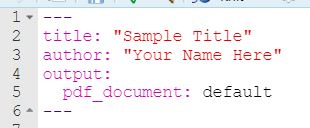
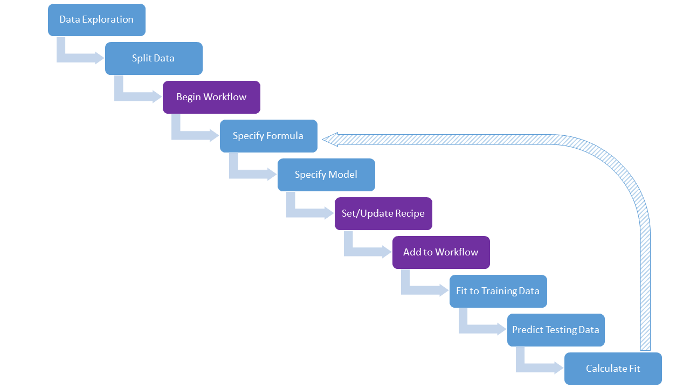

## Data Science (LLO8200)
This is the course website for Professor Hartigan's sections of LLO 8200, Introduction to Data Science. Make sure you bookmark and check this page frequently for the most up-to-date files to use for both async and problem sets. Over the course of the term code may be optimized or corrected. I will upload updated files here when that happens. You should have R, RStudio, and the tidyverse package installed and updated prior to the first day of class. Instructions for installing/updating R and Rstudio can be found [here](./Downloading Installing Updating R and RStudio.pdf).

You are responsible for reviewing and ensuring you are following the schedule included in this semester's syllabus. The most up-to-date syllabus can always be found here and I will update the date when changes are made: [Hartigan/Garcia Summer 2022 LLO8200 Syllabus - 5/11/22](./Hartigan_Garcia_LLO8200_syllabus_summer2022.pdf). 

If you want to set up email alerts for updates/additions to this site, you can use the free version of a third-party program: [Distill](https://distill.io/). The free version will check for updates every six hours and send you alerts. Note: this is a platform that is not owned by Vanderbilt or me and you should review their data privacy and security to ensure you are comfortable with their practices.

### Async/Sync RStudio (.Rmd) Files
I will upload .Rmd files here in weeks that code has been optimized/updated. You should check here weekly to see if there is updated code before completing your async. If you don't see an .Rmd file for a given week, the file on the LMS is current. The first file below (LMS Mod 0) is the file we use for our bootcamp meeting. The R Setup Slide Deck includes good information on R/Rstudio structure and some troubleshooting tips. Reference these if you experience errors (particularly with knitting).        
           
LMS Mod 0 - [.Rmd Bootcamp File](./00_Getting Started.Rmd), [Bootcamp knit lecture notes](./00_Getting-Started.html), [R Setup Slide Deck](./Intro to R_final.pptx)\
LMS Mod 1 - no updates\

### Datasets for the Semester     
*these are all available on the LMS - removing from here to avoid confusion*     

### Problem Sets
Each problem set should be uploaded to the LMS _before_ we meet for live session on the given due date. All submissions must include two files to receive credit:
1. .Rmd code file.
2. "Knit" file. The knit file can be in pdf or html (pdf is preferred). Word docs will NOT be accepted. 

Note that you must upload BOTH files BEFORE you hit "submit" in the LMS; if you try to submit them one at a time, it will only allow you to upload one. Also, you are responsible for reviewing the files before uploading (check formatting, output, etc.). I will not accept submissions via email (unless there are extenuating circumstances). **There will be a penalty for submissions not meeting these requirements.**

All problem sets are graded on a 100-point scale. Corrections can be submitted for any problem set and you can earn up to half of the deducted points back. You have one week from the time you receive feedback to submit corrections (while you can work with study buddies for the original problem set submission, corrections must be done on your own).

| File(s)      | Due Date          |
|:-------------|:------------------|
| [Problem Set 1 .Rmd File](https://raw.githubusercontent.com/lhartigan15/LLO8200_updated/main/01_ProblemSet_Mods1_2_3_starter.Rmd); [Problem Set 1 pdf](./01_ProblemSet_Mods1_2_3_starter.pdf) | 06/01/22 |
| [Problem Set 2 placeholder] | 06/15/22 |
| [Problem Set 3 placeholder] | 06/29/22 |
| [Problem Set 4 placeholder] | 07/20/22 |
| [Problem Set 5 placeholder] | 08/10/22 |

### Final Project Materials
* [Final Project Expectations placeholder], [Final Project Rubrics placeholder] - final products due 08/12/22
* [Progress Report 1 Instructions](./Progress Report 1 - Instructions.pdf) - due 06/08/22
* [Progress Report 2 Instructions placeholder] - due 07/06/22
* [Progress Report 3 Instructions placeholder] - due 07/27/22

#### Final Project Examples
Note: these are all strong examples; but that doesn't mean they are all perfect. You should reference the supplied rubrics to ensure you're meeting all expectations. 
##### Presentations
* [Broadband Speeds in Louisiana](./Broadband Speeds in Louisiana_presentation.pdf)
* [Exploring Institutional Placements in TX Child Welfare System](./Exploring Institutional Placements in TX Child Welfare System_presentation.pdf)
* [Teacher Attrition in DC](./Teacher Attrition in DC_presentation.pdf)

##### Reports (with associated .Rmd files)
* [Predictors of Student Vaping in TN](./Final-Project---Example.pdf), [Associated .Rmd file](./Final Project - Example.Rmd)
* [Broadband Speeds in Louisiana](./Broadband Speeds in Louisiana_report.pdf), [Associated .Rmd file](./Broadband Speeds in Louisiana.Rmd)
* [Exploring Institutional Placements in TX Child Welfare System](./Exploring Institutional Placements in TX Child Welfare System_report.pdf), [Associated .Rmd file](./Exploring Institutional Placements in TX Child Welfare System.Rmd)
* [Predicting Time on Death Row in Florida](./Predicting Time on Death Row in Florida_report.pdf), [Associated .Rmd file](./Predicting Time on Death Row in Florida.Rmd)

### Additional Resources
"Common R Errors" doc: We've created a shared Box document and added everyone in this class as an editor. Please use this as a resource (and add to it when you figure out how to address an R error you've gotten). You can access it [HERE](https://vanderbilt.box.com/s/4v3frpekn0p1k2tpv3r06xmyha5zce3h) (you will need to login with your Vandy email). 

The YAML header conundrum... When you download an .Rmd file from this site, the YAML header will be removed (for some reason). Here is a sample header that you can reference when adding the header at the top of your .Rmd file. Remember, your header MUST begin on line 1 of your .Rmd file and the formatting must stay consistent in order for it to work (e.g., must begin with three dashes and end with three dashes).       

Training & Testing & Workflows, OH MY! To help picture the workflow process we use to provide structure to our model-building-processes, Dr. Garcia drafted this excellent graphic. This will be useful for Modules 5, on. 

There are a multitude of resources re. RStudio and RMarkdown on the web. Here is where I'll save some of my favorites. 
* [R Markdown Reference Guide](./rmarkdown-reference.pdf)
* [R Markdown Cheat Sheet](./rmarkdown-cheatsheet.pdf)
* [R Color Palette Cheat Sheet](./colorPaletteCheatsheet.pdf)
* [GGplot Cheat Sheet](./ggplot2-cheatsheet.pdf)

Additional Practice
* [Census data with R (advanced course)](https://www.census.gov/data/academy/courses/ranking-project.html)
* [Mapping census data with R using choroplethr (intermediate course)](https://www.census.gov/data/academy/courses/choroplethr.html)
* [Squirrel census - mapping exercise](https://annielyu.com/2019/10/29/fun-leaflet-in-r-with-nyc-squirrel-census-data/)
* [ggplot2](https://rpubs.com/williamsurles/295930)
* [ggplot2](http://euclid.psych.yorku.ca/www/psy6135/tutorials/gapminder.html)
* [Linear regression](https://www.machinelearningplus.com/machine-learning/complete-introduction-linear-regression-r/)
* [Logistic regression/classification](https://towardsdatascience.com/modelling-binary-logistic-regression-using-tidymodels-library-in-r-part-1-c1bdce0ac055)
* [Logistic regression/classification](https://ntaback.github.io/UofT_STA130/week8/Week8PracticeProblems-solutions1.html)
* [Logistic regression/classification](https://rpubs.com/AIventurer/datacamp_R_ML_TB_Ch2)
* [K-fold cross validation](https://drsimonj.svbtle.com/k-fold-cross-validation-with-modelr-and-broom)
* [Random partititioning/Monte Carlo approach to cross validation](https://ijlyttle.github.io/model_cv_selection.html)
* [Additional Cross Validation for Classification Models .Rmd File](./10_additional_cross_validate_logit.Rmd)
